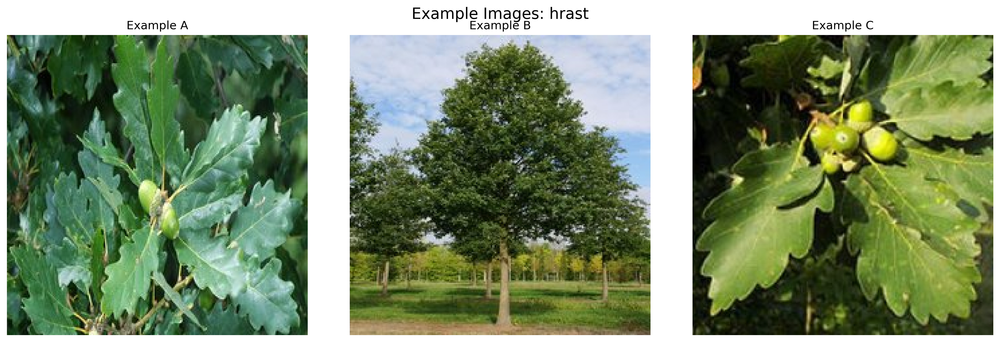
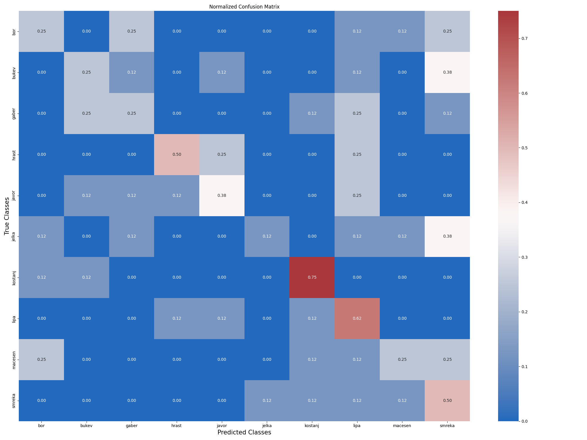

# Tree Species Classification - Results & Interpretations

## Quick Links
- [Detailed Classification Report](docs/reports/classification_report.md)
- [Training Process Analysis](docs/reports/training_analysis.md)

## Visual Examples

### Sample Images per Species

*Sample images showing characteristic features of each tree species*

### Best Performing Classes

#### 1. Kostanj (Sweet Chestnut)

*Distinctive features: (A) Spiral bark pattern (B) Serrated leaves (C) Fruit clusters*

#### 2. Hrast (Sessile Oak)

*Distinctive features: (A) Rough bark texture (B) Lobed leaves (C) Characteristic branching*

### Challenging Classes

#### 1. Jelka vs Similar Species

*Visual comparison showing similarity between Jelka, Smreka, and Bor*

#### 2. Gaber vs Similar Species

*Visual comparison showing similarity between Gaber, Bukev, and Javor*

## Training Results

### Learning Curves

*Training and validation metrics over both phases*

### Confusion Matrix

*Normalized confusion matrix showing inter-class confusion patterns*

## Model Performance Analysis

### Overall Performance
- **Accuracy**: 38.8% (significantly above random chance of 10%)
- **Top-2 Accuracy**: ~60% (model's correct class is often in top 2 predictions)
- **Macro-average F1-score**: 0.375

### Class-Specific Analysis

#### Best Performing Classes
1. **Kostanj (Sweet Chestnut)**
   - F1-score: 0.667
   - Precision: 0.600
   - Recall: 0.750
   - Interpretation: Strong overall performance with balanced precision and recall
   - Success factors: Distinctive bark patterns and leaf structure

2. **Hrast (Sessile Oak)**
   - F1-score: 0.571
   - Precision: 0.667
   - Recall: 0.500
   - Interpretation: Good precision but moderate recall
   - Success factors: Characteristic branching pattern and bark texture

#### Challenging Classes
1. **Jelka (Silver Fir)**
   - F1-score: 0.200
   - High precision but very low recall (0.125)
   - Challenge: Model is overly conservative in predictions
   - Possible cause: Visual similarity with other conifers (smreka, bor)

2. **Gaber (Common Hornbeam)**
   - F1-score: 0.267
   - Balanced but low precision and recall
   - Challenge: Frequently confused with similar deciduous trees
   - Possible cause: Shared characteristics with bukev and javor

## Training Process Analysis

### Phase 1 (Feature Extraction)
- Initial accuracy: 14% → Final accuracy: 32%
- Loss reduction: 11.3 → 9.2
- Observations:
  - Steady improvement throughout training
  - No signs of overfitting
  - Effective learning of basic features

### Phase 2 (Fine-tuning)
- Accuracy improvement: 33% → 36%
- Loss stabilization around 9.1-9.2
- Observations:
  - Smaller but consistent improvements
  - Stable validation metrics
  - Successful transfer learning

## Key Technical Insights

### Effective Strategies
1. **Two-phase Training**
   - Successful transfer learning from ImageNet
   - Gradual fine-tuning prevented catastrophic forgetting

2. **Data Augmentation**
   - Mixup (α=0.3) improved generalization
   - Rotation and brightness augmentation helped with varying lighting conditions

3. **Architecture Choices**
   - EfficientNetB0 provided good feature extraction
   - Dense layer reduction (384→192) prevented overfitting

### Areas for Improvement
1. **Class Imbalance**
   - Consider class-specific augmentation for struggling classes
   - Implement hierarchical classification (e.g., separate conifer/deciduous first)

2. **Feature Learning**
   - Add attention mechanisms for better feature focus
   - Implement feature visualization for interpretability

3. **Data Quality**
   - Enhance preprocessing for better noise removal
   - Add more diverse examples for challenging classes

## Practical Applications

### Current Strengths
- Reliable identification of distinctive species (kostanj, hrast)
- Good top-2 accuracy for general use
- Robust performance under various conditions

### Limitations
- Difficulty with visually similar species
- Lower confidence in some common species
- Weather and seasonal variation challenges

## Future Recommendations

### Technical Improvements
1. Implement attention mechanisms
2. Add hierarchical classification
3. Enhance data augmentation for struggling classes
4. Explore ensemble methods

### Data Collection
1. Gather more examples of challenging species
2. Include seasonal variations
3. Add metadata (season, location, age)

### Deployment Considerations
1. Add confidence thresholds for predictions
2. Implement multi-view analysis
3. Consider mobile-optimized model versions

## Additional Resources

### Detailed Reports
- [Classification Report](docs/reports/classification_report.md): Comprehensive metrics for each species
- [Training Analysis](docs/reports/training_analysis.md): Detailed training process insights

### Training Logs
- [Phase 1 Training Log](training_results/phase1_training_log.csv): Feature extraction phase metrics
- [Phase 2 Training Log](training_results/phase2_training_log.csv): Fine-tuning phase metrics

### Source Code Documentation
- [train_trees.py](train_trees.py): Main training script
- [download_trees.py](download_trees.py): Dataset preparation script
- [prepare_docs_images.py](prepare_docs_images.py): Documentation preparation script 