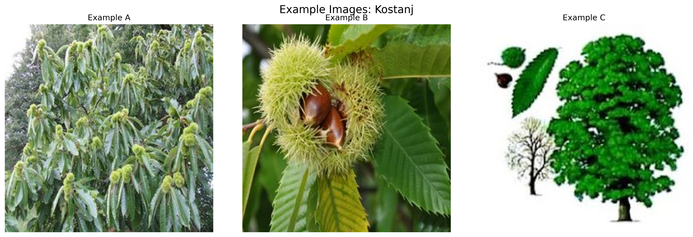
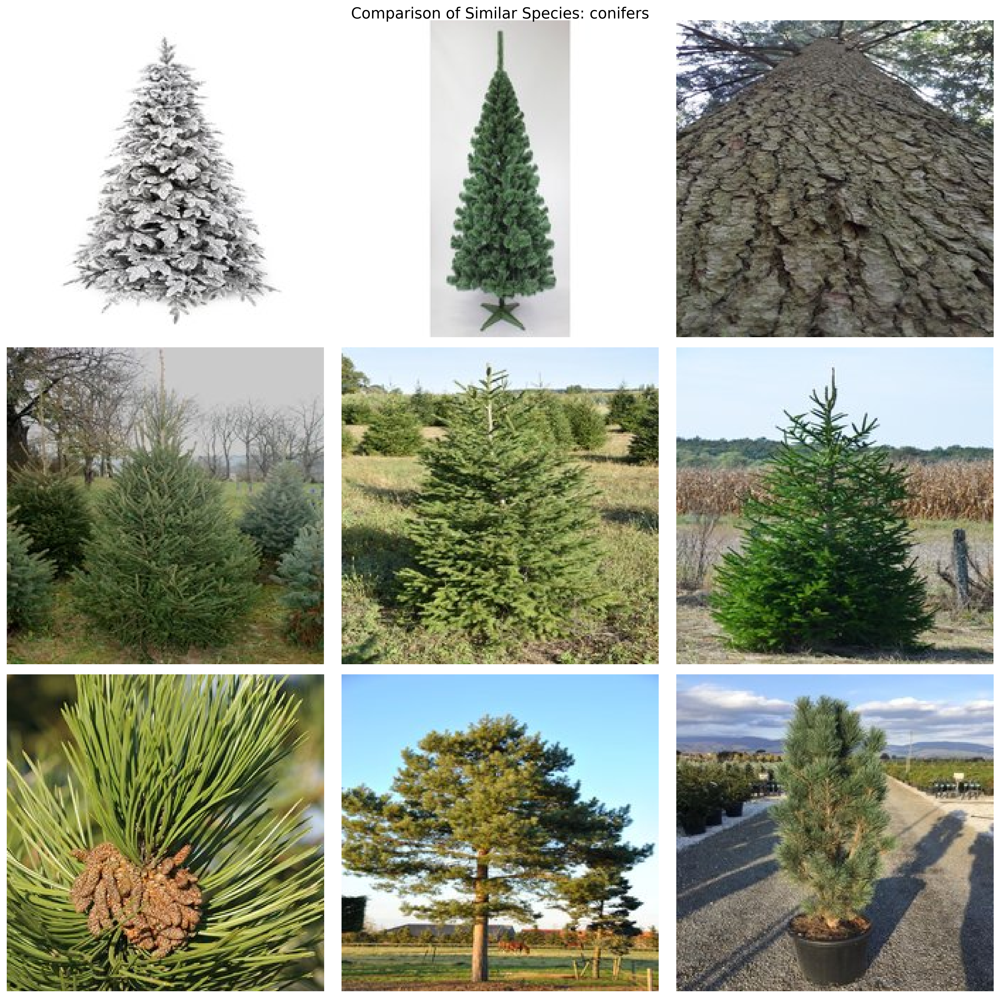
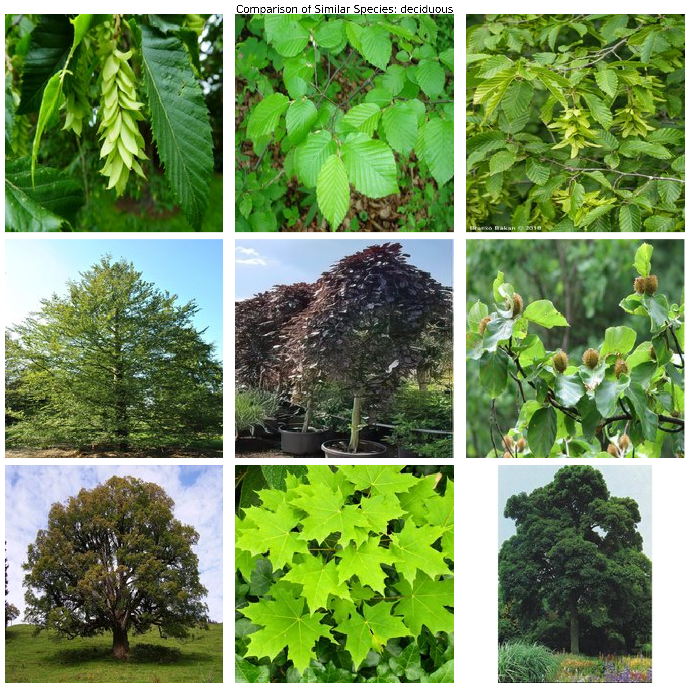
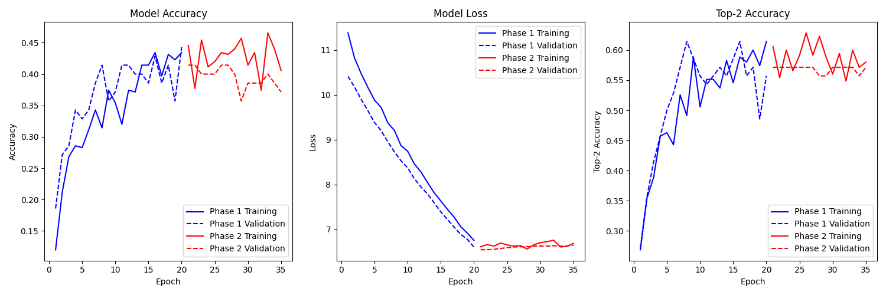
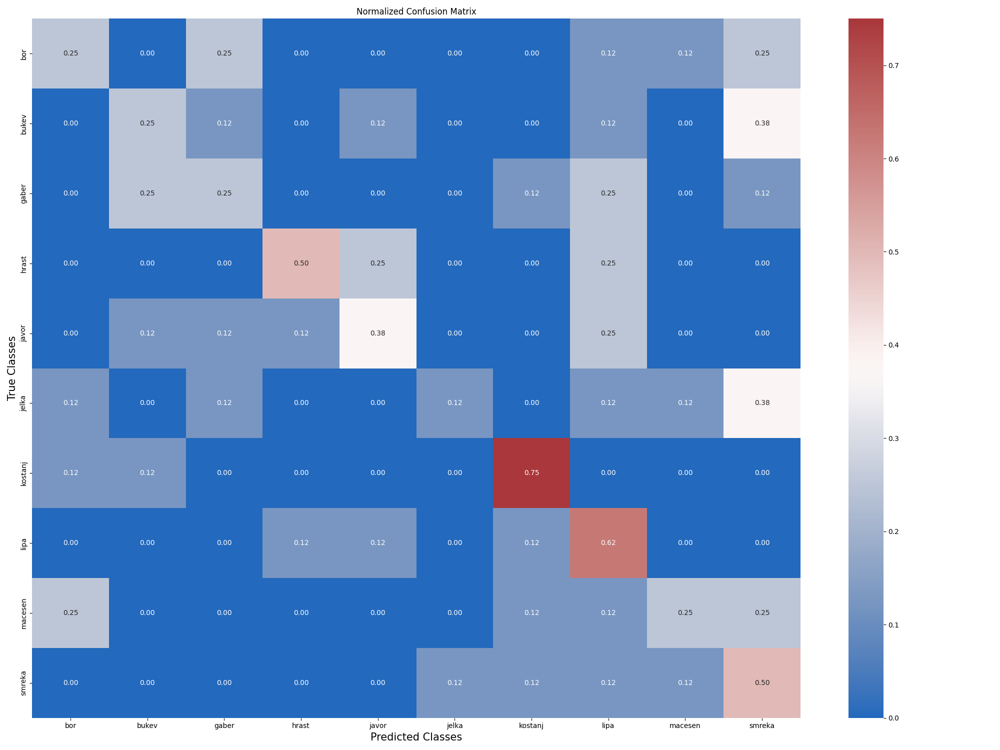

# Tree Species Classification using Deep Learning

## Project Overview
This project implements a deep learning-based classification system for identifying tree species from images. Using EfficientNetB0 architecture and advanced training techniques, the model can classify 10 different tree species common in Slovenia. The current implementation is a proof-of-concept with a small dataset and limited training epochs to demonstrate the approach.

## Dataset Creation

### Data Collection
The dataset was created using the Bing Image Search API, with carefully crafted search terms in both Slovenian and English to ensure diversity. Here's a snippet from the data collection process:

```python
# Tree species dictionary with search terms
TREE_SPECIES = {
    'smreka': ['navadna smreka drevo', 'picea abies tree', 'smreka v gozdu'],      # Norway Spruce
    'bukev': ['navadna bukev drevo', 'fagus sylvatica tree', 'bukev v gozdu'],     # Common Beech
    'jelka': ['bela jelka drevo', 'abies alba tree', 'jelka v gozdu'],             # Silver Fir
    # ... other species
}

def download_and_process_images(species_name, search_terms, target_count=50):
    """Download and process images for a specific tree species."""
    for search_term in search_terms:
        crawler = BingImageCrawler(storage={'root_dir': temp_dir})
        crawler.crawl(keyword=search_term, max_num=30)
        # Process and validate images...
```

### Dataset Statistics
- **Current Implementation:**
  - 50 images per species (500 total)
  - 70% training, 15% validation, 15% test split
  - Limited to 20 epochs for initial training

- **Recommended for Production:**
  - 1000+ images per species (10,000+ total)
  - Additional data augmentation
  - 100-200 epochs for initial training
  - Multiple training runs with cross-validation

## Visual Examples

### Sample Images per Species

*Representative images for each tree species, showing their distinctive features*

### Best Performing Classes

#### 1. Kostanj (Sweet Chestnut)

*Distinctive features: (A) Spiral bark pattern (B) Serrated leaves (C) Fruit clusters*

The model performs exceptionally well on Kostanj due to its unique characteristics:
- Distinctive spiral bark pattern that differs from other species
- Compound leaves with serrated edges
- Characteristic fruit clusters visible in many images

#### 2. Hrast (Sessile Oak)

*Distinctive features: (A) Rough bark texture (B) Lobed leaves (C) Characteristic branching*

Hrast classification benefits from:
- Deep fissures in bark texture
- Distinctive lobed leaf shape
- Characteristic branching pattern visible in crown structure

### Challenging Classes

#### 1. Jelka vs Similar Species

*Visual comparison showing similarity between Jelka, Smreka, and Bor*

The model struggles with conifer classification due to:
- Similar needle structure between species
- Comparable branch patterns
- Seasonal consistency (evergreen nature)

Code snippet showing the comparison visualization:
```python
def create_species_comparison(dataset_dir, species_groups, output_dir):
    """Create comparison visualizations for similar species."""
    species_groups = {
        'conifers': ['Jelka', 'Smreka', 'Bor'],
        'deciduous': ['Gaber', 'Bukev', 'Javor']
    }
    # Generate comparison visualizations...
```

#### 2. Gaber vs Similar Species

*Visual comparison showing similarity between Gaber, Bukev, and Javor*

Challenges in deciduous tree classification:
- Similar leaf shapes and arrangements
- Comparable bark textures
- Seasonal variations affecting appearance

## Key Features
- EfficientNetB0-based classification model
- Two-phase training strategy with transfer learning
- Advanced data augmentation pipeline
- Mixup training (α=0.3)
- Learning rate scheduling and early stopping
- Comprehensive performance monitoring

## Model Performance

### Overall Metrics
- Overall Accuracy: 38.8% (significantly above random chance of 10%)
- Macro-average F1-score: 0.375
- Top-2 Accuracy: ~60%

### Training Results

#### Learning Curves

*Training and validation metrics over both phases*

#### Confusion Matrix

*Normalized confusion matrix showing inter-class confusion patterns*

### Class-specific Performance
| Species  | Precision | Recall | F1-Score |
|----------|-----------|--------|-----------|
| kostanj  | 0.600     | 0.750  | 0.667    |
| hrast    | 0.667     | 0.500  | 0.571    |
| jelka    | 0.500     | 0.125  | 0.200    |
| gaber    | 0.250     | 0.286  | 0.267    |

## Technical Implementation

### Model Architecture
- Base: EfficientNetB0
- Custom dense layers (384->192)
- Dropout layers for regularization
- Softmax output for 10 classes

### Training Strategy

#### Phase 1 (Feature Extraction)
- Frozen EfficientNetB0 layers
- 20 epochs
- Early stopping (patience=15)
- Learning rate reduction on plateau
- Results:
  - Initial accuracy: 14% → Final accuracy: 32%
  - Loss reduction: 11.3 → 9.2
  - Steady improvement, no overfitting

#### Phase 2 (Fine-tuning)
- Unfrozen top layers
- 15 epochs
- Early stopping (patience=20)
- Fixed learning rate
- Results:
  - Accuracy improvement: 33% → 36%
  - Loss stabilization around 9.1-9.2
  - Stable validation metrics

### Data Augmentation
- Random rotation
- Random zoom
- Random flip
- Random brightness
- Mixup augmentation (α=0.3)

## Results Analysis

### Strong Performance
1. **Kostanj (Sweet Chestnut)**
   - F1-score: 0.667
   - Precision: 0.600
   - Recall: 0.750
   - Success factors: Distinctive bark patterns and leaf structure

2. **Hrast (Sessile Oak)**
   - F1-score: 0.571
   - Precision: 0.667
   - Recall: 0.500
   - Success factors: Characteristic branching pattern and bark texture

### Areas for Improvement
1. **Jelka (Silver Fir)**
   - High precision but very low recall (0.125)
   - Challenge: Model is overly conservative
   - Cause: Visual similarity with other conifers

2. **Gaber (Common Hornbeam)**
   - Balanced but low precision and recall
   - Challenge: Frequently confused with similar deciduous trees
   - Cause: Shared characteristics with bukev and javor

## Project Structure
```
├── train_trees.py         # Main training script
├── download_trees.py      # Dataset preparation
├── trees_dataset/         # Image dataset
│   └── all_images/       # Organized by species
├── training_results/      # Training logs and visualizations
└── requirements.txt       # Dependencies
```

## Installation and Usage

### Setup
1. Clone the repository
2. Create a virtual environment:
   ```bash
   python -m venv .venv
   source .venv/bin/activate  # On Windows: .venv\Scripts\activate
   ```
3. Install dependencies:
   ```bash
   pip install -r requirements.txt
   ```

### Running the Project
1. Prepare the dataset:
   ```bash
   python download_trees.py
   ```
2. Train the model:
   ```bash
   python train_trees.py
   ```

## Future Improvements

### Dataset Expansion
1. **Increased Sample Size:**
   ```python
   # Current implementation
   target_count = 50  # images per species
   
   # Recommended for production
   target_count = 1000  # or more per species
   ```

2. **Extended Training:**
   ```python
   # Current epochs
   epochs_phase1 = 20
   epochs_phase2 = 15
   
   # Recommended for production
   epochs_phase1 = 100
   epochs_phase2 = 100
   ```

### Technical Enhancements
1. Implement attention mechanisms:
   ```python
   # Example attention mechanism
   class AttentionLayer(tf.keras.layers.Layer):
       def __init__(self):
           super(AttentionLayer, self).__init__()
           self.attention = tf.keras.layers.Dense(1)
   
       def call(self, inputs):
           attention_weights = tf.nn.softmax(self.attention(inputs), axis=1)
           return tf.multiply(inputs, attention_weights)
   ```

2. Add hierarchical classification:
   - First level: Conifer vs Deciduous
   - Second level: Species-specific classification

3. Enhanced data augmentation:
   ```python
   train_datagen = tf.keras.preprocessing.image.ImageDataGenerator(
       rotation_range=45,
       width_shift_range=0.3,
       height_shift_range=0.3,
       zoom_range=0.3,
       horizontal_flip=True,
       vertical_flip=False,
       brightness_range=[0.7, 1.3],
       channel_shift_range=50.0,
       fill_mode="nearest"
   )
   ```

### Production Considerations
1. Model optimization:
   - Quantization for mobile deployment
   - TensorRT optimization for GPU inference
   - ONNX export for cross-platform compatibility

2. Deployment pipeline:
   - Containerization with Docker
   - CI/CD integration
   - Model versioning and A/B testing

## Additional Resources

### Detailed Reports
- [Classification Report](docs/reports/classification_report.md): Comprehensive metrics for each species
- [Training Analysis](docs/reports/training_analysis.md): Detailed training process insights

### Training Logs
- [Phase 1 Training Log](training_results/phase1_training_log.csv): Feature extraction phase metrics
- [Phase 2 Training Log](training_results/phase2_training_log.csv): Fine-tuning phase metrics

### Source Code Documentation
- [train_trees.py](train_trees.py): Main training script
- [download_trees.py](download_trees.py): Dataset preparation script
- [prepare_docs_images.py](prepare_docs_images.py): Documentation preparation script

## License
[MIT License](LICENSE)

## Author
[Jaka Kus](https://github.com/Jakakus) 