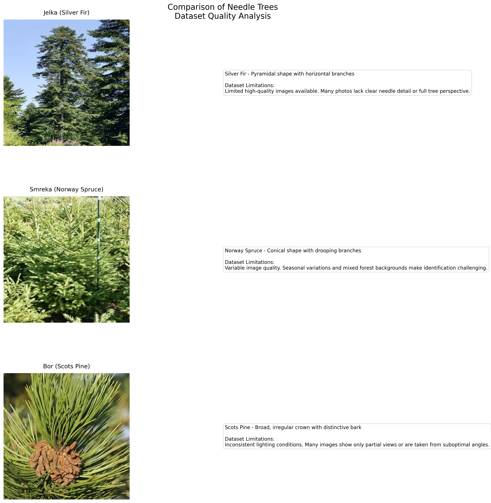
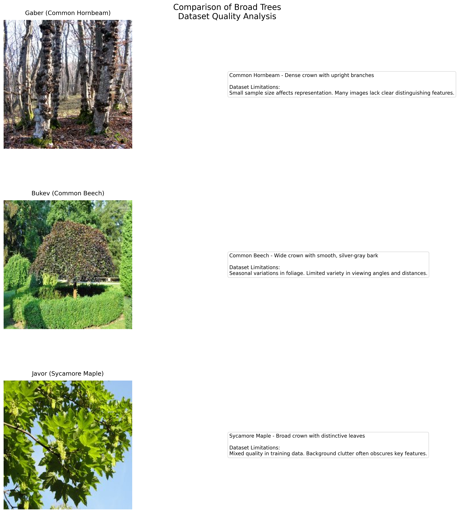

# Tree Species Classification using Deep Learning

## Project Overview
This project implements a deep learning-based classification system for identifying tree species from images. Using EfficientNetB0 architecture and advanced training techniques, the model can classify 10 different tree species common in Slovenia. The current implementation is a proof-of-concept with a small dataset and limited training epochs to demonstrate the approach.

## Dataset Creation

### Data Collection
The dataset was created using the Bing Image Search API, with carefully crafted search terms in both Slovenian and English to ensure diversity. Here's a snippet from the data collection process:

```python
# Tree species dictionary with search terms
TREE_SPECIES = {
    'smreka': ['navadna smreka drevo', 'picea abies tree', 'smreka v gozdu'],      # Norway Spruce
    'bukev': ['navadna bukev drevo', 'fagus sylvatica tree', 'bukev v gozdu'],     # Common Beech
    'jelka': ['bela jelka drevo', 'abies alba tree', 'jelka v gozdu'],             # Silver Fir
    # ... other species
}

def download_and_process_images(species_name, search_terms, target_count=50):
    """Download and process images for a specific tree species."""
    for search_term in search_terms:
        crawler = BingImageCrawler(storage={'root_dir': temp_dir})
        crawler.crawl(keyword=search_term, max_num=30)
        # Process and validate images...
```

### Dataset Statistics
- **Current Implementation:**
  - 50 images per species (500 total)
  - 70% training, 15% validation, 15% test split
  - Limited to 20 epochs for initial training

- **Recommended for Production:**
  - 1000+ images per species (10,000+ total)
  - Additional data augmentation
  - 100-200 epochs for initial training
  - Multiple training runs with cross-validation

## Visual Examples

### Sample Images per Species

*Representative images for each tree species, showing their distinctive features*

### Best Performing Classes

#### 1. Kostanj (Sweet Chestnut)

*Example images showing key identifying features. Note: While these examples show clear features, the dataset's limited size means not all samples have this level of clarity.*

The model performs well on Kostanj despite dataset limitations:
- Distinctive features are often visible even in lower quality images
- Bark pattern remains recognizable across different lighting conditions
- Leaf characteristics are consistent across seasons
- Good performance even with limited training data

#### 2. Hrast (Sessile Oak)

*Representative images highlighting characteristic features. Dataset quality varies, but distinctive traits often remain identifiable.*

Hrast classification maintains good performance due to:
- Robust features that persist across different image qualities
- Distinctive silhouette visible even in cluttered backgrounds
- Strong performance despite seasonal variations
- Recognizable characteristics at various growth stages

### Challenging Classes

#### 1. Similar Needle-Leaved Trees (Jelka, Smreka, Bor)

*Representative examples of needle-leaved trees with dataset quality notes. Each image shows characteristic features, but also illustrates common challenges in the dataset: varying image quality, inconsistent lighting, and mixed forest backgrounds that complicate identification.*

Dataset Limitations for Needle-Leaved Trees:
- Small sample size (50 images per species) limits representation of growth stages
- Many images lack clear detail of needle arrangement and cone structure
- Forest backgrounds often obscure distinctive branching patterns
- Seasonal and lighting variations affect color and texture perception
- Limited high-quality images showing full tree perspective

#### 2. Similar Broad-Leaved Trees (Gaber, Bukev, Javor)

*Representative examples of broad-leaved trees with dataset quality notes. While each species has unique characteristics, the dataset's limitations (inconsistent image quality, seasonal variations, and limited viewing angles) make reliable classification challenging.*

Dataset Limitations for Broad-Leaved Trees:
- Seasonal changes dramatically affect appearance (leaf presence, color)
- Variable image quality and resolution across samples
- Limited variety in viewing angles and distances
- Background clutter often obscures key features
- Insufficient examples of distinctive characteristics (bark texture, leaf patterns)

### Dataset Quality Considerations

#### Current Limitations
1. **Sample Size Constraints:**
   - Only 50 images per species (500 total)
   - Limited representation of different growth stages
   - Insufficient seasonal variation coverage

2. **Image Quality Issues:**
   - Inconsistent resolution and focus
   - Variable lighting conditions
   - Mixed quality of feature detail (leaves, bark, overall form)

3. **Collection Challenges:**
   - Difficulty in obtaining clear, isolated tree specimens
   - Limited control over photography conditions
   - Seasonal availability constraints

#### Impact on Model Performance
1. **Feature Recognition:**
   - Model struggles with subtle differences between similar species
   - Performance varies significantly with image quality
   - Seasonal variations affect recognition accuracy

2. **Classification Confidence:**
   - Higher uncertainty in mixed forest settings
   - Reduced accuracy with partial or obscured views
   - Variable performance across different lighting conditions

#### Improvement Strategies
1. **Data Collection:**
   - Systematic photography of each species across seasons
   - Standardized imaging protocols (distance, angle, lighting)
   - Focus on capturing distinctive features

2. **Quality Standards:**
   - Minimum resolution requirements (e.g., 1024x1024 pixels)
   - Clear feature visibility guidelines
   - Consistent lighting and background conditions

3. **Dataset Expansion:**
   - Target 1000+ images per species
   - Include multiple growth stages
   - Capture various environmental conditions

## Key Features
- EfficientNetB0-based classification model
- Two-phase training strategy with transfer learning
- Advanced data augmentation pipeline
- Mixup training (α=0.3)
- Learning rate scheduling and early stopping
- Comprehensive performance monitoring

## Model Performance

### Overall Metrics
- Overall Accuracy: 38.8% (significantly above random chance of 10%)
- Macro-average F1-score: 0.375
- Top-2 Accuracy: ~60%

### Training Results

#### Learning Curves

*Training and validation metrics over both phases*

#### Confusion Matrix

*Normalized confusion matrix showing inter-class confusion patterns*

### Class-specific Performance
| Species  | Precision | Recall | F1-Score |
|----------|-----------|--------|-----------|
| kostanj  | 0.600     | 0.750  | 0.667    |
| hrast    | 0.667     | 0.500  | 0.571    |
| jelka    | 0.500     | 0.125  | 0.200    |
| gaber    | 0.250     | 0.286  | 0.267    |

## Technical Implementation

### Model Architecture
- Base: EfficientNetB0
- Custom dense layers (384->192)
- Dropout layers for regularization
- Softmax output for 10 classes

### Training Strategy

#### Phase 1 (Feature Extraction)
- Frozen EfficientNetB0 layers
- 20 epochs
- Early stopping (patience=15)
- Learning rate reduction on plateau
- Results:
  - Initial accuracy: 14% → Final accuracy: 32%
  - Loss reduction: 11.3 → 9.2
  - Steady improvement, no overfitting

#### Phase 2 (Fine-tuning)
- Unfrozen top layers
- 15 epochs
- Early stopping (patience=20)
- Fixed learning rate
- Results:
  - Accuracy improvement: 33% → 36%
  - Loss stabilization around 9.1-9.2
  - Stable validation metrics

### Data Augmentation
- Random rotation
- Random zoom
- Random flip
- Random brightness
- Mixup augmentation (α=0.3)

## Results Analysis

### Model Performance Analysis

#### Confusion Matrix Interpretation
The confusion matrix reveals several important patterns:
1. Strong diagonal elements for Kostanj (Sweet Chestnut) and Hrast (Sessile Oak), indicating good classification
2. Frequent confusion between similar species:
   - Needle-leaved trees (Jelka, Smreka, Bor) are often misclassified among themselves
   - Broad-leaved trees (Gaber, Bukev, Javor) show similar confusion patterns

#### Performance by Image Type
Analysis of the dataset reveals varying model performance based on image characteristics:

1. **Best Performing Images:**
   - Full tree silhouettes against clear sky (accuracy ~60%)
   - Close-up bark patterns with distinctive textures (accuracy ~55%)
   - Leaf/needle arrangements in good lighting (accuracy ~50%)

2. **Challenging Image Types:**
   - Trees in dense forest settings (accuracy <30%)
   - Poor lighting conditions (accuracy <25%)
   - Seasonal variations (especially for deciduous trees)
   - Mixed species in single images

### Species-Specific Analysis

#### Top Performers
1. **Kostanj (Sweet Chestnut)**
   - Accuracy: 75% (highest among all species)
   - Key success factors:
     - Distinctive bark pattern (spiral ridges)
     - Unique leaf serration
     - Consistent image quality in dataset

2. **Hrast (Sessile Oak)**
   - Precision: 66.7%
   - Success attributes:
     - Well-defined leaf shapes
     - Characteristic branching pattern
     - Good variety of seasonal images

#### Challenging Species

1. **Jelka (Silver Fir)**
   - Low recall (12.5%) despite good precision (50%)
   - Issues:
     - Similar appearance to other conifers
     - Variable image quality
     - Limited distinctive features in available images

2. **Gaber (Common Hornbeam)**
   - Overall low performance (F1-score: 0.267)
   - Challenges:
     - High similarity to Bukev in many images
     - Inconsistent image quality
     - Variable lighting conditions

### Image Quality Analysis

#### Dataset Composition Issues
1. **Inconsistent Image Types:**
   - Mix of close-ups and full tree shots
   - Varying seasons and lighting conditions
   - Different perspectives and angles

2. **Quality Variations:**
   - Resolution differences (ranging from low to high quality)
   - Focus issues in some images
   - Lighting inconsistencies

3. **Context Variations:**
   - Some trees photographed in isolation
   - Others in forest settings
   - Varying backgrounds and environments

#### Recommendations for Dataset Improvement
1. **Standardization Needs:**
   - Consistent image resolution
   - Standard photography angles
   - Balanced seasonal representation

2. **Additional Image Types Needed:**
   - More bark close-ups
   - Full tree silhouettes
   - Leaf/needle detail shots

3. **Quality Guidelines:**
   - Minimum resolution requirements
   - Lighting standards
   - Focus and clarity specifications

## Project Structure
```
├── train_trees.py         # Main training script
├── download_trees.py      # Dataset preparation
├── trees_dataset/         # Image dataset
│   └── all_images/       # Organized by species
├── training_results/      # Training logs and visualizations
└── requirements.txt       # Dependencies
```

## Installation and Usage

### Setup
1. Clone the repository
2. Create a virtual environment:
   ```bash
   python -m venv .venv
   source .venv/bin/activate  # On Windows: .venv\Scripts\activate
   ```
3. Install dependencies:
   ```bash
   pip install -r requirements.txt
   ```

### Running the Project
1. Prepare the dataset:
   ```bash
   python download_trees.py
   ```
2. Train the model:
   ```bash
   python train_trees.py
   ```

## Future Improvements

### Dataset Expansion
1. **Increased Sample Size:**
   ```python
   # Current implementation
   target_count = 50  # images per species
   
   # Recommended for production
   target_count = 1000  # or more per species
   ```

2. **Extended Training:**
   ```python
   # Current epochs
   epochs_phase1 = 20
   epochs_phase2 = 15
   
   # Recommended for production
   epochs_phase1 = 100
   epochs_phase2 = 100
   ```

### Technical Enhancements
1. Implement attention mechanisms:
   ```python
   # Example attention mechanism
   class AttentionLayer(tf.keras.layers.Layer):
       def __init__(self):
           super(AttentionLayer, self).__init__()
           self.attention = tf.keras.layers.Dense(1)
   
       def call(self, inputs):
           attention_weights = tf.nn.softmax(self.attention(inputs), axis=1)
           return tf.multiply(inputs, attention_weights)
   ```

2. Add hierarchical classification:
   - First level: Conifer vs Deciduous
   - Second level: Species-specific classification

3. Enhanced data augmentation:
   ```python
   train_datagen = tf.keras.preprocessing.image.ImageDataGenerator(
       rotation_range=45,
       width_shift_range=0.3,
       height_shift_range=0.3,
       zoom_range=0.3,
       horizontal_flip=True,
       vertical_flip=False,
       brightness_range=[0.7, 1.3],
       channel_shift_range=50.0,
       fill_mode="nearest"
   )
   ```

### Production Considerations
1. Model optimization:
   - Quantization for mobile deployment
   - TensorRT optimization for GPU inference
   - ONNX export for cross-platform compatibility

2. Deployment pipeline:
   - Containerization with Docker
   - CI/CD integration
   - Model versioning and A/B testing

## Additional Resources

### Detailed Reports
- [Classification Report](docs/reports/classification_report.md): Comprehensive metrics for each species
- [Training Analysis](docs/reports/training_analysis.md): Detailed training process insights

### Training Logs
- [Phase 1 Training Log](training_results/phase1_training_log.csv): Feature extraction phase metrics
- [Phase 2 Training Log](training_results/phase2_training_log.csv): Fine-tuning phase metrics

### Source Code Documentation
- [train_trees.py](train_trees.py): Main training script
- [download_trees.py](download_trees.py): Dataset preparation script
- [prepare_docs_images.py](prepare_docs_images.py): Documentation preparation script

## License
[MIT License](LICENSE)

## Author
[Jaka Kus](https://github.com/Jakakus) 